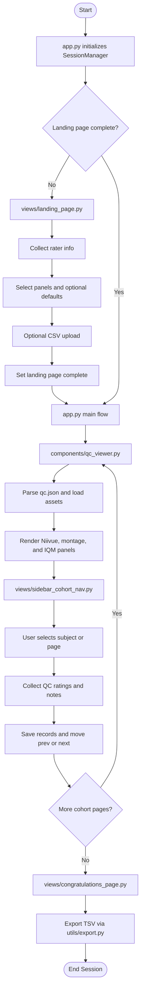
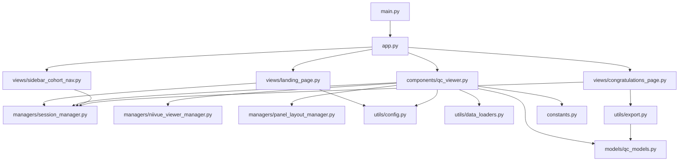

# QC-Studio Architecture Documentation

## Overview

QC-Studio is a Streamlit-based quality control application for neuroimaging data. This document describes the refactored architecture, module organization, and data flow.

---

## Directory Structure

```
ui/
├── app.py                        # Streamlit App Entry (Main Application)
├── main.py                       # CLI Entry Point
├── constants.py                  # Core configuration and message strings
│
├── components/                   # Reusable UI Components
│   ├── __init__.py              # Package exports
│   ├── qc_viewer.py             # QC viewer orchestration
│
├── pages/                        # Streamlit multipage sidebar (thin entrypoints → views/)
│   ├── 1_Landing_Page.py
│   └── 2_Congratulations_Page.py
├── views/                        # Full-page view implementations (imported by app + pages/)
│   ├── __init__.py
│   ├── landing_page.py          # Onboarding and configuration
│   ├── congratulations_page.py  # Results and export
│   └── sidebar_cohort_nav.py    # Sidebar cohort navigation + controls
│
├── managers/                     # Business Logic & State Management
│   ├── __init__.py
│   ├── session_manager.py       # Session state facade
│   ├── niivue_viewer_manager.py # Niivue configuration
│   └── panel_layout_manager.py  # Panel layout logic
│
├── models/                       # Data Models & Types
│   ├── __init__.py              # Clean exports (backward compatible)
│   ├── qc_models.py             # Pydantic models
│   └── README.md                # Model documentation
│
├── utils/                        # Utility Functions by Domain
│   ├── __init__.py
│   ├── config.py                # QC config parsing
│   ├── data_loaders.py          # Data loading and file I/O
│   ├── image_processing.py      # Image montage creation
│   └── export.py                # CSV export
│
└── tests/                        # Comprehensive Test Suite
    ├── conftest.py              # Shared test fixtures
    ├── test_*.py                # 10+ test modules
    └── README.md                # Testing documentation
```

### Architecture Overview

```
┌──────────────────────────────────────────────────────────────┐
│                    Entry Points                              │
│  ├─ app.py (Streamlit web app)                              │
│  └─ main.py (CLI entry)                                     │
└──────────────────────────────────────────────────────────────┘
                             ↓
┌──────────────────────────────────────────────────────────────┐
│               UI Layer (Pages & Components)                  │
│  ├─ views/landing_page.py (Onboarding)                      │
│  ├─ components/qc_viewer.py (Viewer Organization)           │
│  ├─ views/sidebar_cohort_nav.py (Sidebar Cohort Controls)   │
│  └─ views/congratulations_page.py (Results)                │
└──────────────────────────────────────────────────────────────┘
                             ↓
┌──────────────────────────────────────────────────────────────┐
│            Manager Layer (Business Logic)                    │
│  ├─ managers/session_manager.py (State)                     │
│  ├─ managers/niivue_viewer_manager.py (Viewer Config)       │
│  └─ managers/panel_layout_manager.py (Layout)               │
└──────────────────────────────────────────────────────────────┘
                             ↓
┌──────────────────────────────────────────────────────────────┐
│         Data Layer (Models, Utils, Config)                  │
│  ├─ models/qc_models.py (Data Models)                       │
│  ├─ utils/data_loaders.py (File I/O)                        │
│  ├─ utils/config.py (Configuration)                         │
│  ├─ utils/image_processing.py (Image Utilities)             │
│  ├─ utils/export.py (Export Utilities)                      │
│  └─ constants.py (Global Configuration)                     │
└──────────────────────────────────────────────────────────────┘
```

---

## Module Organization

### Layer 0: Entry Points

#### `app.py` - Streamlit Application Entry
**Responsibility**: Main web application orchestration

**Imports**: 
- Screen modules: `views.landing_page`, `views.congratulations_page`
- Components: `components.qc_viewer`
- Managers: SessionManager, NiivueViewerManager, PanelLayoutManager
- Utilities: parse_qc_config, load_montage_data, save_qc_results_to_csv

---

#### `main.py` - CLI Entry Point
**Responsibility**: Command-line interface for running the application

It parses CLI arguments, resolves configuration, and launches the Streamlit app.

---

### Layer 1: Page Components (Full Page Views)

Pages represent complete, full-width views shown at different stages of the QC workflow.

#### `views/landing_page.py`
**Responsibility**: Onboarding and initial QC session configuration

**Data Flow**:
1. User enters rater information
2. User selects which panels to display (Niivue, Montage, IQM)
3. User optionally uploads CSV of previous QC records
4. SessionManager stores all state
5. Continue to QC viewers page

---

#### `views/congratulations_page.py`
**Responsibility**: Display final results and export QC records

**Data Flow**:
1. Display number of participants reviewed
2. Show QC statistics (PASS/FAIL/UNCERTAIN counts)
3. Offer CSV export with duplicate handling
4. Navigation back to landing page

---

### Layer 2: Components (Reusable UI Components)

Components are reusable UI building blocks that can appear within pages.

#### `components/qc_viewer.py`
**Responsibility**: Orchestrate QC viewer display, QC rating controls, and page-level navigation actions.

**Data Flow**:
1. Load QC configuration and image data
2. Get panel selection from SessionManager
3. Render appropriate layout based on selected panels
4. Display images with metadata
5. Collect QC decisions and notes for the current page
6. Save QC records and advance or rewind pagination through SessionManager

---

#### `views/sidebar_cohort_nav.py`
**Responsibility**: Sidebar subject list, completion markers, and page navigation controls

**Data Flow**:
1. Read current cohort/session state from SessionManager
2. Render one sidebar control per cohort row with completion status
3. Route subject/page changes through SessionManager and rerun
4. Optionally prepend pagination controls when requested by caller

---

#### `congratulations_page.py`
**Responsibility**: Display final results and export options

**Dependencies**: SessionManager, save_qc_results_to_csv() from utils

---

### Layer 3: Manager Classes (Business Logic)

Managers handle complex application logic and provide structured access to functionality.

#### `managers/session_manager.py`
**Responsibility**: Centralized, type-safe session state management

**Class**: `SessionManager` (all static methods)

**Design Pattern**: Static facade over `st.session_state`
- Provides type safety and validation
- Centralizes key names (SESSION_KEYS const)
- Easy mocking in tests
- Reduces scattered `st.session_state` access

---

#### `managers/niivue_viewer_manager.py`
**Responsibility**: Niivue 3D medical image viewer configuration and rendering

**Data Flow**:
1. `render_controls_panel()` displays dropdowns and checkboxes
2. User selections → NiivueViewerConfig object
3. Config passed to `build_viewer_kwargs()`
4. Settings include: nifti_data, overlays, view settings, unique key
5. `render_viewer()` renders Niivue component in Streamlit

---

#### `managers/panel_layout_manager.py`
**Responsibility**: Dynamic panel layout, visibility, and responsive design

It centralizes layout ratios, visibility decisions, and panel sizing rules.

---

### Layer 4: Data Models & Configuration

#### `models/qc_models.py`
**Responsibility**: Pydantic data models for type safety and validation

**Benefits**:
- Runtime validation of QC data
- Type hints for IDE autocomplete
- JSON schema generation
- Serialization/deserialization support

---

#### `models/__init__.py`
**Responsibility**: Clean package exports

**Exports**: All model classes for backward-compatible imports
```python
from models import QCRecord, QCTask, QCConfig, MetricQC, QCDecision, QCStatusRow
```

---

### Layer 5: Utilities (Domain-Specific Functions)

Utilities are organized by domain with focused responsibilities.

#### `utils/config.py`
**Responsibility**: QC configuration file parsing and validation

**Uses**: QCConfig model for validation

---

#### `utils/data_loaders.py`
**Responsibility**: File loading and data retrieval for all image types

It resolves dataset-relative paths, loads MRI/NIfTI data, loads montage assets, and reads IQM files.

---

#### `utils/image_processing.py`
**Responsibility**: Image manipulation and montage creation

It builds grid montages from loaded images and applies sizing/layout rules for display.

---

#### `utils/export.py`
**Responsibility**: Export QC results to standardized formats

It serializes QC records for export, including duplicate-handling logic when requested.

---

#### `constants.py`
**Responsibility**: Global configuration, UI strings, and constants

**Benefits**: Single source of truth for all config and strings

---

## Data Flow

### Complete QC Session Workflow



### Module Interaction Diagram


---

## Troubleshooting

### Common Issues

**Issue**: Panel selection not persisting
- **Check**: `SessionManager.set_panel_selection()` called after checkbox
- **Solution**: Verify SessionManager initialization and session state patching in tests

**Issue**: Niivue viewer not displaying
- **Check**: `load_mri_data()` returns valid base_mri_image_bytes
- **Solution**: Verify qc_config path is correct, MRI file exists

**Issue**: Tests failing with "expected X to have been called"
- **Check**: Mock setup in conftest.py
- **Solution**: These are pre-existing Streamlit mocking issues, not regressions

**Issue**: New manager method not working
- **Check**: Is it calling `st.session_state` correctly?
- **Solution**: Follow pattern from existing methods, use SESSION_KEYS constant

---

## Testing Guide

### Running Tests

**All tests**:
```bash
bash run_tests.sh all
```

**Specific test file**:
```bash
pytest ui/tests/test_session_manager.py -v
```

**Specific test class**:
```bash
pytest ui/tests/test_session_manager.py::TestRaterMethods -v
```

**With coverage report**:
```bash
pytest ui/tests/ --cov=ui --cov-report=html
```

### Writing New Tests

**Template**:
```python
class TestNewFeature:
    """Tests for new feature."""
    
    def test_basic_functionality(self):
        """Test basic operation."""
        # Arrange
        component = SomeComponent()
        
        # Act
        result = component.do_something()
        
        # Assert
        assert result == expected_value
    
    def test_edge_case(self):
        """Test edge case behavior."""
        # Similar structure
```


## References

- **Streamlit Documentation**: https://docs.streamlit.io/
- **Pytest Documentation**: https://docs.pytest.org/
- **Python Design Patterns**: https://refactoring.guru/design-patterns
- **Session State Management**: Streamlit docs on st.session_state

---